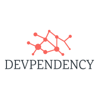
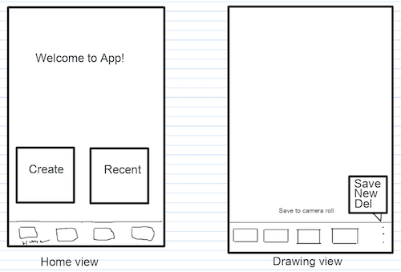
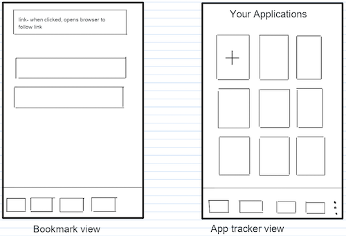
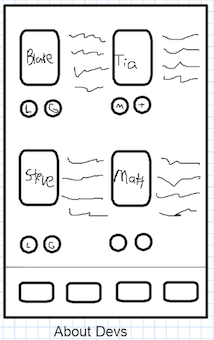

  

## The Devpendents

Dev Low - [Github](https://github.com/TiaLow) || [LinkedIn](https://www.linkedin.com/in/tia-low/)   
Dev Romero - [GitHub](https://github.com/blakerom) || [LinkedIn](https://www.linkedin.com/in/blakeromero/)   
Dev Herriges - [GitHub](https://github.com/herrigesmt) || [LinkedIn](https://www.linkedin.com/in/herrigesmt/)   
Dev Baldock - [GitHub](https://github.com/SBALDOCK) || [LinkedIn](https://www.linkedin.com/in/stephentbaldock/)

# The Devpendency Application
 
**React Native** mobile app for the developer on-the-go, bringing several convenient resources to one place. Provides multiple feature in a clean, easily-navigable user interface.

### Features

**Dev Napkin**: drawing pad to quickly scribble app ideas and notes. Can choose drawing color and tool weight, clear drawing, save, and see saved sketches.

**Bookmarks**: save your helpful online resources in one place. Your collection of bookmarks will persist with the ability to delete as needed. Click the saved bookmark to open in your default web browser.

**Job App Tracker**: quickly keep track of any jobs you've applied for and additional notes as needed. Save them to one collection with the ability to click an individual job to see more details. *Update functionality coming soon!*

## Install

*Project currently relies on Expo CLI, please install first as instructed below if you don't already have it installed. NPM package publish coming soon!*

     npm i -g expo-cli
 

     git clone https://github.com/401d37-Final-Project/devpendency-app.git

  

    cd devpendency-app
 

     npm install
 

     npm add expo 
 

    expo start 

*If you have Expo client installed on your phone, **scan the QR code** and enjoy! Alternatively you can run the app in an emulator. You can view the app in a web browser, although we do not recommend as it is not indicative of viewing as intended on a mobile device.*

## Usage

- Home screen provides a quick summary of the three main features of the application. Static tab navigation at the bottom of the screen lets you explore the features, with nested stack screen navigation inside the Dev Napkin and Jobs features. 
- Experiment with the drawing feature by creating new drawings and saving them for easy accessibility later. 
- Complete the simple form entries to enter in your bookmarks and save to the collection to access later. Notice that your saved bookmark is linked and will navigate to your browser.
  - *Bookmark links must contain the entire url, for example:* **https://github.com**
- Complete form fields to save a job you'd like to track. Saved collection will be a list with quick reference fields. Use the icons to delete a job from the list or expand on an individual job to see more details. Simple navigation back from there to your saved list of all jobs. 
- View the developers involved in the project and link to their GitHub and LinkedIn accounts.

## Contributing
  

1. **Fork** the project on GitHub.
2. **Git clone** the project to your local machine.
3. **Git checkout** your own branch to work on.
4. **Add, Commit** changes to your branch.
5. **Push** changes to your branch.
6. Submit a **Pull Request** so that we can review your changes!

### Contribution Guidelines

 
[Guidelines](CONTRIBUTIONS.md)
 
   *Please note that this project is released with a Contributor Code of Conduct. By participating in this project you agree to abide by its terms. Please contact any of the lead developers to report any violations: [Tia Low](mailto:lowtia@gmail.com), [Steve Baldock](stephenbaldock78@gmail.com), [Matt Herriges](herrigesmt@gmail.com), [Blake Romero](blakeromero001@gmail.com).*
   

## Software Requirements

[Software Requirements](requirements.md)

## Original Wireframes

## UML

## Libraries

- [React Native](https://reactnative.dev/)
- [React Native Paper](https://callstack.github.io/react-native-paper/)
- [React Navigation](https://reactnavigation.org/)
- [React Native SVG](https://www.npmjs.com/package/react-native-svg)
- [React Native Community Picker](https://www.npmjs.com/package/@react-native-community/picker)
- [React Native Async Storage](https://reactnative.dev/docs/asyncstorage)
- [Formik](https://formik.org/)
- [Yup](https://github.com/jquense/yup)
- [Expo](https://expo.io/)
- [Vector Icons](https://docs.expo.io/guides/icons/)
- [Material Community Icons](https://reactnativeelements.com/docs/icon/)
- [Expo Google Fonts](https://www.npmjs.com/package/@expo-google-fonts/inter)

## Resources 

- [React Native Async Storage](https://react-native-async-storage.github.io/async-storage/docs/api/#mergeitem)
- [Icon Search](https://oblador.github.io/react-native-vector-icons/)

- JB Tellez for guidance and support [LinkedIn](https://www.linkedin.com/in/jb-tellez/) || [GitHub](https://github.com/JB-Tellez)
- Sean Murray for assistance with storage persistense [LinkedIn](https://www.linkedin.com/in/sean-j-murray/) || [GitHub](https://github.com/seanjmurray)

## License

[MIT License](LICENSE)

